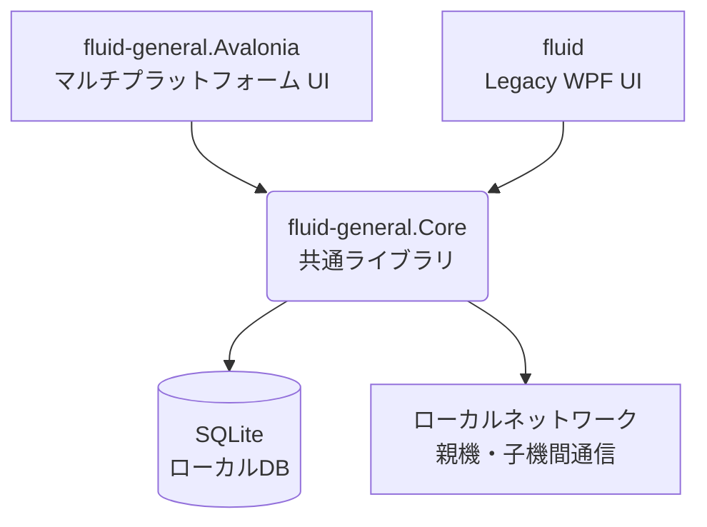

# Fluid General

Fluid General は、.NET 8、Avalonia UI、および WPF を用いて構築された、寮生名簿管理および行事（イベント）のチェックイン・出欠管理アプリケーションです。  
ローカルネットワークを介した親機・子機間のリアルタイム同期に対応し、Windows および macOS（Intel / Apple Silicon）のマルチプラットフォームでネイティブに動作します。

---

## 🚀 以前の「fluid」と現在の「fluid-general」の違い

`fluid-general` は、従来の Windows 専用版である `fluid` のアセットを継承しつつ、以下のような大幅な近代化リファクタリングとアーキテクチャの再設計が行われました。

| 比較項目 | 従来の「fluid」 (WPF版) | 現在の「fluid-general」 |
| :--- | :--- | :--- |
| **対応プラットフォーム** | Windows 専用 | **Windows & macOS (Intel/Apple Silicon)** のマルチプラットフォーム対応 |
| **UI フレームワーク** | WPF (Windows Presentation Foundation) | **Avalonia UI** (メイン) ＋ 互換用WPF (サブ) のマルチUI構成 |
| **アーキテクチャ** | UIとビジネスロジック、データアクセスが密結合 | 共有ビジネスロジック・モデル・通信部を **`fluid-general.Core`** へ完全集約し分離 |
| **ローカルネットワーク同期** | ポート競合等による不安定な接続性 | ポートの最適化（51500/51501）および UDP ブロードキャストによる堅牢な自動検出・再接続 |
| **名簿・イベント一覧のUX** | 動作パフォーマンスに課題のある多段レイアウト | カラム構成の最適化、ダブルクリックによる詳細展開、直感的な右クリックでの編集・削除 |
| **Excelインポート/エクスポート** | 制限された項目のみの入出力 | カスタムメタデータを含む全名簿情報のClosedXML高速インポート・エクスポート |

---

## 🛠️ システム構成

本作は、ビジネスロジックを共有しつつ、複数のUIフロントエンドを提供する設計となっています。



### プロジェクト構成

* **`fluid-general.Core`**  
  データベースアクセス（SQLite / Entity Framework）、データモデル（`Member`, `EventConfig`など）、ローカル通信API（親機HTTPサーバー、子機通信クライアント、UDPブロードキャスト検出）などの共通処理を集約したプロジェクトです。
* **`fluid-general.Avalonia`**  
  Windows および macOS でネイティブ動作する、現代的なUI（Fluentデザイン風アクリル背景など）を備えたメインアプリケーションです。
* **`fluid`**  
  Windows環境での動作・下位互換性のために残された WPF バージョンです。
* **`FluidSetup`**  
  Windows 向けのインストーラー生成やリリースパッケージ構築用プロジェクトです。

---

## ✨ 主要機能

1. **寮生名簿管理**
   * Excel ファイル (`.xlsx`) からの高速一括インポート機能（ClosedXML採用）。
   * 学籍番号、氏名、カナの他、名簿ごとに動的なカスタム属性（カスタムフィールド）の定義と紐付けが可能。
   * ダブルクリックによる寮生個別詳細画面の表示。
   * 名簿全体の Excel 出力機能。

2. **寮行事・イベント出欠チェックイン**
   * 行事の新規作成、日付設定、名簿の自動選択。
   * 直感的なダブルクリックでの行事開始、および右クリックによるイベントの即時編集・削除機能。
   * バーコードスキャナーやテンキー等を用いた迅速なチェックイン受付。
   * 学校学年別、男女別等のリアルタイム出欠ヘッドカウント統計表示。

3. **ローカルネットワーク同期 (親機・子機モード)**
   * 同一LAN環境内での親機・子機リンク機能。
   * 親機側のIPアドレスや接続端子数を自動検出し、タイトルバー等にステータスをリアルタイム表示。
   * UDP ブロードキャストによる自動セッションディスカバリ。
   * 非衝突ポート (51500 / 51501) による通信の安定化。

---

## ⚙️ 開発環境のセットアップ

### 必要要件
* **.NET 8 SDK** / **.NET 10 SDK** (Avalonia版で一部利用)
* IDE: Visual Studio 2022 または JetBrains Rider (Avalonia / WPF 開発プラグイン推奨)
* データベース: SQLite (自動生成されるローカルDBを利用します)

### ビルド方法
ソリューションのルートディレクトリで以下を実行します。

```bash
# ソリューション全体のビルド
dotnet build fluid-general.sln
```

---

## 📦 リリース・パッケージング方法

詳細なリリース手順は [リリース方法.md](file:///c:/Project/fluid-general/FluidGeneral%E3%82%BB%E3%83%83%E3%83%88%E3%82%A2%E3%83%83%E3%83%97%E9%96%A2%E4%BF%82/%E3%83%AA%E3%83%AA%E3%83%BC%E3%82%B9%E6%96%B9%E6%B3%95.md) に記載されています。

### Windows 向け発行
```bash
dotnet publish fluid-general.Avalonia/fluid-general.Avalonia.csproj -c Release -r win-x64 --self-contained true -p:PublishSingleFile=true -p:PublishReadyToRun=true
```
発行後、Inno Setup を利用して `FluidGeneral.iss` からインストーラーをビルドします。

### macOS 向け発行
```bash
# Apple Silicon (M1/M2/M3...) 向け
dotnet publish fluid-general.Avalonia/fluid-general.Avalonia.csproj -c Release -r osx-arm64 --self-contained true

# Intel Mac 向け
dotnet publish fluid-general.Avalonia/fluid-general.Avalonia.csproj -c Release -r osx-x64 --self-contained true
```
発行後、ドラッグ＆ドロップでインプレースインストール可能な `.dmg` ディスクイメージファイルを組み立てます。